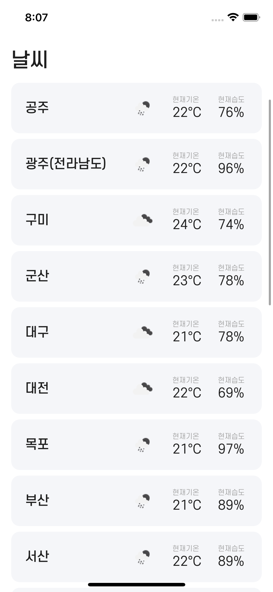
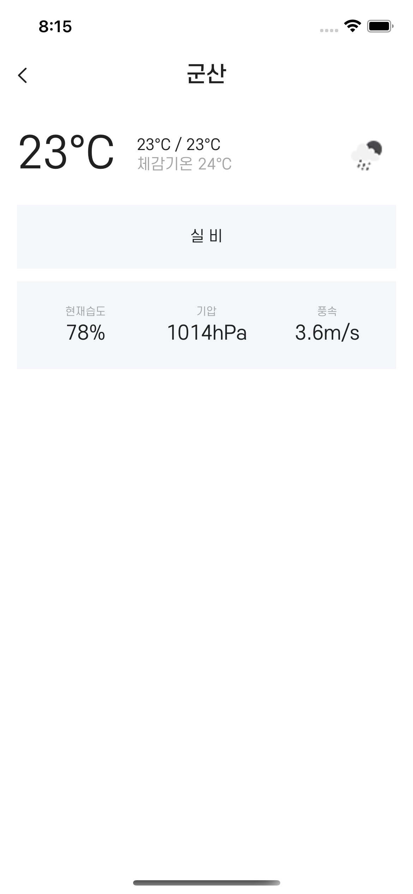
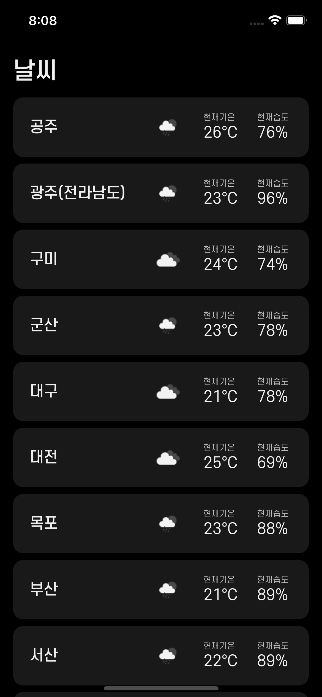

# wanted_pre_onboarding

## List 페이지

각 지역의 이름, 기온, 습도, 날씨를 리스트 형태로 표시합니다.

 

리스트에서 Cell을 선택하면, Detail 페이지로 이동합니다.

 

 

## Detail 페이지

선택한 지역의 도시이름, 날씨 아이콘, 현재기온, 체감기온, 헌재습도, 최저기온, 최고기온, 기압, 풍속, 날씨설명을 표시합니다.

 

 

## 다크모드 지원

